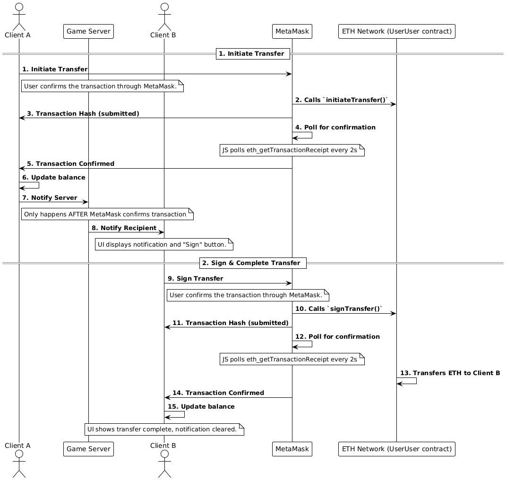

# EthNetwork: Blockchain-Based IoT Interaction Framework

This repository contains the blockchain infrastructure and smart contracts for enabling interactions between users and IoT devices in a multiplayer environment. It serves as the backend for the [Unity Environment](https://github.com/ETH-Unity/UnityNethereum).

## Overview

The EthNetwork provides:
- Local Quorum blockchain testnet configuration
- Smart contracts for different interaction types:
  - User-to-User interactions
  - User-to-Device interactions
  - Device-to-Device interactions (coming soon)
- Deployment instructions and tools

## Prerequisites

- Windows 10/11
- [Docker Desktop](https://www.docker.com/products/docker-desktop/)
- [Windows Subsystem for Linux (WSL)](https://learn.microsoft.com/en-us/windows/wsl/install)
- [Node.js](https://nodejs.org/) (v14+)
- [MetaMask](https://metamask.io/download/) browser extension
- [Remix IDE](https://remix.ethereum.org/)

## Quorum Testnet Setup

### Installation

1. Ensure Docker Desktop is running
2. Open a terminal in WSL
3. Install the Quorum Developer Quickstart:
   ```bash
   npx quorum-dev-quickstart
   ```

### Starting the Network

1. Navigate to the generated quickstart directory:
   ```bash
   cd quorum-test-network
   ```

2. Start the network:
   ```bash
   ./start.sh
   ```
   
### Network Details

Once running, your local Quorum network exposes:
- RPC URL: `http://localhost:8545`
- Network ID: `1337`
- Block Explorer: `http://localhost:25000`
- BlockScout : `http://localhost:26000` (optional)

## Connecting MetaMask to Quorum

1. Open MetaMask and click on the network dropdown
2. Select "Add Network" > "Add a network manually"
3. Enter the following details:
   - Network Name: `Quorum Local`
   - RPC URL: `http://localhost:8545`
   - Chain ID: `1337`
   - Currency Symbol: `ETH`

4. Import test accounts using private keys from:
   ```
   quorum-test-network\config\nodes
   ```

## Smart Contracts

### Contract Overview

#### UserUser Contract
The `UserUser` smart contract enables transfers between users in the unity environment. Instead of direct transfers, funds are **held in the contract** as **pending transfers**, which must be **explicitly signed** by the recipient to complete. Additionally a message can be sent within the transaction which gets stored in the contract and gets returned to the recipient when signed.



#### UserDevice Contract
The `UserDevice` smart contract provides access control system designed to manage access control for users interacting with an IoT device. In this case, the device is represented as a "door," which can be either a physical or digital resource. The contract enables an owner and designated admins to assign, modify, or revoke permissions, determining which users can interact with the device and under what conditions.

##### Table of Access Control Roles
| **Role** | Grant/Revoke Basic | Grant/Revoke Admin | Open Door |
|:--:|:--:|:--:|:--:|
| None (0) | ❌ | ❌ | ❌ |
| Default (1) | ❌ | ❌ | ❓ |
| Admin (2)| ✅ | ❌ | ✅ |
| Owner (Deployer) | ✅ | ✅ | ✅ |


#### DeviceDevice Contract
The DeviceDevice smart contract is designed to manage interactions between IoT devices. In this case, it links a sensor and a fan, enabling the sensor to report temperature data to the blockchain.


## Remix

### Deploying Contracts

1. Open [Remix IDE](https://remix.ethereum.org/)
2. Create new files and copy the contract code from:
   - `Contracts/UserUser.sol`
   - `Contracts/UserDevice.sol`
   - `Contracts/DeviceDevice.sol`

3. Compile the contracts:
   - Use the Solidity compiler specified in the contract
   - Click "Compile" for each contract

4. Deploy to Quorum:
   - Select "ENVIRONMENT" as "Injected Provider - MetaMask"
   - Connect with your Quorum-connected MetaMask
   - Select the contract to deploy
   - Click "Deploy"

### Contract ABIs
If contracts are modified make sure to obtain the updated ABI file from remix and update the ABI in Unity
1. In Remix, go to the "Solidity Compiler" tab
2. Compile the given contract
3. Copy the ABI JSON from the popup


## Unity Integration

To connect the Unity environment with these contracts:

1. Copy the deployed contract address from Remix
2. Add the contract addresses to `Assets/Resources/configKeys.json` in Unity:
```json 
{
	"ethereum":  {
		"doorPrivateKey": "Door Account Private Key Here",
		"tempPrivateKey": "Temperature Sensor Private Key Here",
		"contractUserUser": "Use-User contract address here",
		"contractUserDevice": "Use-Device contract address here",
		"contractDeviceDevice": "Device-Device contract address here",
		"rpcUrl":  "http://127.0.0.1:8545"
	},
	"network":  {
	"chainId":  1337,
	"networkName":  "testnet"
	}
}
 ```

## Troubleshooting

### Common Issues

- **Can't connect to Quorum**: Ensure Docker containers are running properly
- **MetaMask transaction errors**: Check you have enough ETH in your account
- **Contract deployment fails**: Verify compiler version matches contract requirements

## License

This project is licensed under the MIT License